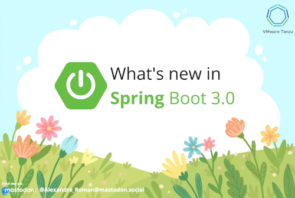

Welcome to this repository!

If you're into [Spring Boot](https://spring.io/projects/spring-boot),
you're in good hands: this repository highlights some of the new features
available starting Spring Boot 3.0.

In a nutshell, this version brings in these new features:

- [Spring Framework 6.0](https://spring.io/blog/2022/11/16/spring-framework-6-0-goes-ga):
  the next big thing in the Spring success story, Java 17 is now the base version
- [GraalVM support](https://docs.spring.io/spring-boot/docs/3.0.0-RC2/reference/html/native-image.html):
  native image as a first-class citizen in the Spring ecosystem,
  compile your Java app as a native process with a lower memory footprint
  and a faster startup
- better support for [OpenTelemetry](https://opentelemetry.io/):
  Spring Boot provides the latest version of [Micrometer](https://micrometer.io/),
  a vendor-neutral application metrics facade which allows you to leverage
  OpenTelemetry to plug in your favorite observability tools
- the move to Jakarta API: no more `javax.*` packages, it's time to move to
  the next version of Java EE, aka Jakarta with `jakarta.*` packages
- and more...

Check out this video from Josh Long to learn more about
Spring Boot 3.0 and Spring Framework 6.0:

This repository is splitted in modules:

- [java17](java17): see some of the new language features you can use in your Java apps
- [native](native): check out how to use GraalVM to compile your Spring Boot app
  as a native process
- [otel](otel): a microservice-based app featuring OpenTelemetry, Zipkin, Knative,
  GraalVM and tools from the Grafana OSS stack (Tempo, Loki, promtail)

Each module includes some documentation showcasing the new features.
You can deploy the apps to your favorite Kubernetes cluster.

Hope it helps!

## Contribute

Contributions are always welcome!

Feel free to open issues & send PR.

## License

Copyright &copy; 2022 [VMware, Inc. or its affiliates](https://vmware.com).

This project is licensed under the [Apache Software License version 2.0](https://www.apache.org/licenses/LICENSE-2.0).
