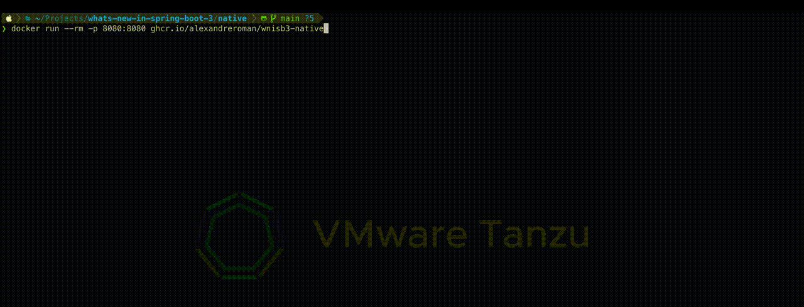

# GraalVM support with Spring Boot 3.0

This module describes how to create a GraalVM native image out of
your Spring Boot based Java app.

## How to run this app?

You don't need install GraalVM on your workstation: the native image will be built
leveraging [Cloud Native Buildpacks](https://buildpacks.io). A container-based process
will take care of building your app as a native process with GraalVM and its dependencies.

That's why you need to install the `pack` CLI in order to use Buildpacks:
[follow these instructions](https://buildpacks.io/docs/tools/pack/#install).

Make sure you have a Docker daemon running.

Run this command to compile the app into a native process:

```shell
./mvnw -Pnative spring-boot:build-image
```

Wait a few minutes until the compilation is done... ☕

Run this command to start the app:

```shell
docker run --rm -p 8080:8080 ghcr.io/alexandreroman/wnisb3-native
```

Note how fast the app starts! 🚀



The app is available at http://localhost:8080.

## Deploy this app to Kubernetes

Go to the [`k8s`](../k8s) directory and follow instructions to
start a local cluster on your workstation.

As soon as you have a Kubernetes cluster up and running, proceed to the next step.

From the [`k8s/wnisb3-native`](../k8s/wnisb3-native) directory, run this command to
deploy the app to your Kubernetes cluster:

```shell
make install
```

Run this command to uninstall the app from your cluster:

```shell
make uninstall
```
