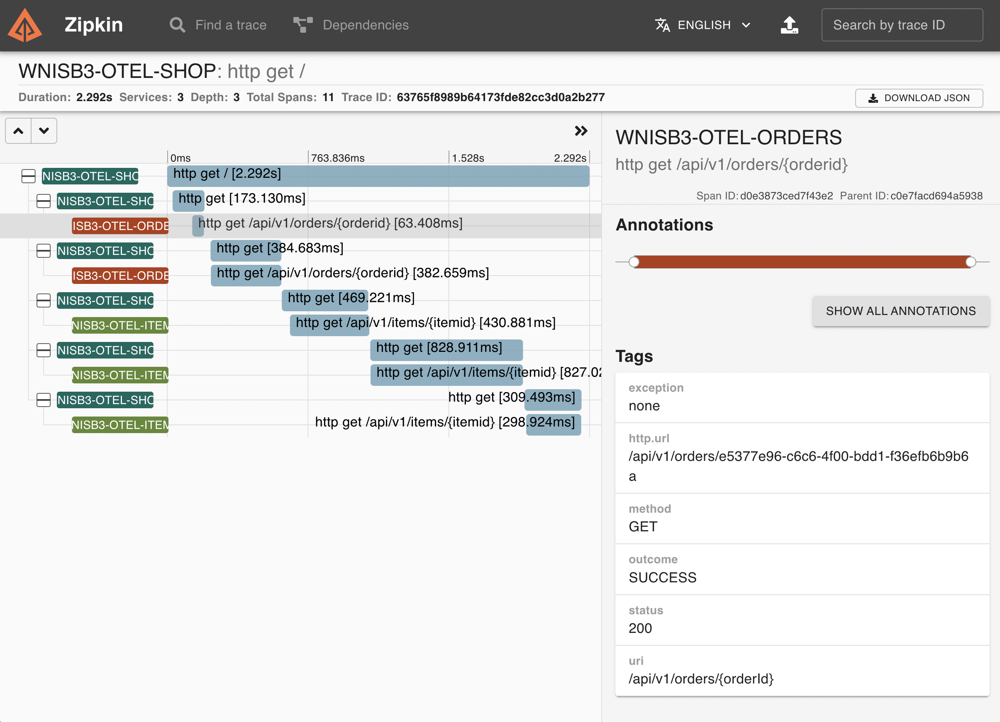
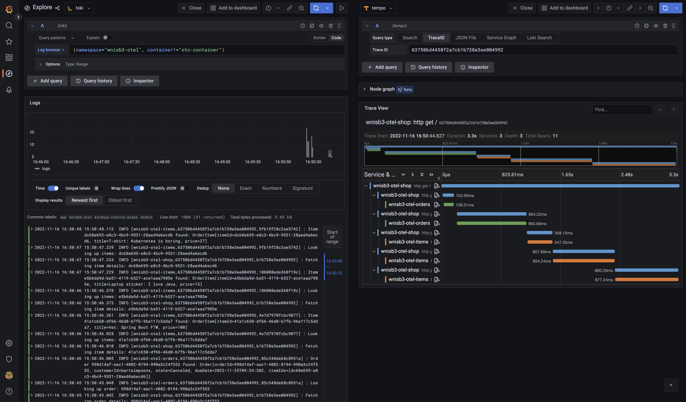

# OpenTelemetry support with Spring Boot 3.0

This module highlights the use of [OpenTelemetry](https://opentelemetry.io) through
[Micrometer](https://micrometer.io) with Spring Boot 3.0.

## How to run this app?

This app is made of 3 modules:

- shop: the main entry point
- orders
- items

Run these commands to start the app and its modules:

```shell
./mvnw -pl shop spring-boot:run
```

```shell
./mvnw -pl orders spring-boot:run
```

```shell
./mvnw -pl items spring-boot:run
```

Tracing is enabled by default: you may want to start Zipkin to collect
tracing spans (otherwise you may see errors in the logs).

Use this command to start a Zipkin instance (you need a Docker daemon running):

```shell
docker run --rm -p 9411:9411 openzipkin/zipkin:latest
```

You can now hit this page at http://localhost:8080 and see the app in action.

```shell
curl localhost:8080
```

This command should return the following output:

```yaml
{
  title: "Welcome to SpringBootShop!",
  orders:
    [
      {
        orderId: "e5377e96-c6c6-4f00-bdd1-f36efb6b9b6a",
        customerId: "johndoe",
        state: "New",
        dueDate: "2022-11-14T09:13:30Z",
        items:
          [
            {
              itemId: "41a1c650-df66-46d0-b7fb-96a117c5dda7",
              title: "Hat: Spring Boot FTW",
              price: "100",
            },
            {
              itemId: "e5b6da9d-ba51-4119-b527-ace1aaa7985e",
              title: "Laptop sticker: I love Java",
              price: "15",
            },
          ],
      },
      {
        orderId: "998d14af-aac1-4082-8194-990a3c24f553",
        customerId: "bartsimpsons",
        state: "Canceled",
        dueDate: "2022-11-25T09:34:30Z",
        items:
          [
            {
              itemId: "dc68e695-e8c3-4bc9-9531-28aed4a6ecd6",
              title: "T-shirt: Kubernetes is boring",
              price: "27",
            },
          ],
      },
    ],
}
```

Orders entities are returned by the `orders` module.
Order items entities are managed by the `items` module.

Go to http://localhost:9411 to use Zipkin and see the network requests
between the different modules of the app:



Those network requests have been instrumented thanks to Micrometer Tracing:
note that you don't need to update your source code to collect tracing spans.

One more thing: there is no [RestTemplate](https://docs.spring.io/spring-framework/docs/current/javadoc-api/org/springframework/web/client/RestTemplate.html)
/ [WebClient](https://docs.spring.io/spring-framework/docs/current/javadoc-api/org/springframework/web/reactive/function/client/WebClient.html)
involved. All network requests rely on declarative HTTP service interfaces
(a new feature starting Spring Boot 3.0):

```java
interface OrderServiceClient {
    @GetExchange("/api/v1/orders/{orderId}")
    Order findOrder(@PathVariable("orderId") String orderId);
}
```

Metrics are available through an OpenTelemetry receiver:
when a collector is running on `localhost:4318/v1/metrics`, metrics are
periodically pushed to this instance.

You can create custom metrics using the Micrometer API:

```java
@Configuration(proxyBeanMethods = false)
class MetricsConf {
    @Bean
    @Qualifier("indexPageHitCounter")
    Counter indexPageHitCounter(MeterRegistry reg) {
        return Counter.builder("hit.counter")
                .baseUnit("hits")
                .description("Hit counter")
                .tags("page", "index").register(reg);
    }
}
```

No matter which observability tool you use (for example: Prometheus),
OpenTelemetry through Micrometer would handle metrics.

## Deploy this app to Kubernetes

Go to the [`k8s`](../k8s) directory and follow instructions to
start a local cluster on your workstation.

As soon as you have a Kubernetes cluster up and running, proceed to the next step.

You need to run Knative and OpenTelemetry Operator in your cluster
before you deploy the app.

From the [`k8s/wnisb3-otel`](../k8s/wnisb3-otel) directory, run this command to
deploy the app to your Kubernetes cluster:

```shell
make install
```

Depending on your configuration, you may have to update the settings
in `kustomization.yaml` regarding the endpoints.
The default configuration works fine with the local cluster you can create
on your workstation.

When using this app along with the Grafana OSS stack
(included in the local cluster configuration), you can visualize logs, metrics,
and tracing spans collected by OpenTelemetry in a single tool.

And thanks to OpenTelemetry, you can switch Grafana with your favorite observability
tool without having to update your app. Pretty sweet!



Run this command to uninstall the app from your cluster:

```shell
make uninstall
```
